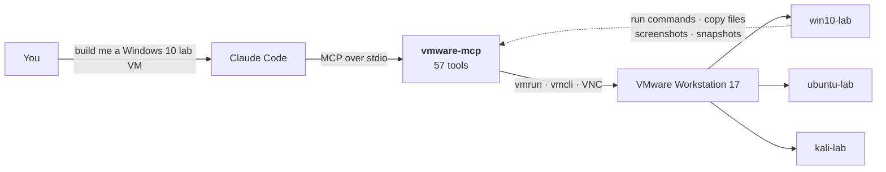

# vmware-mcp — build and drive VMware VMs from an AI agent

**An MCP server that gives Claude hands inside VMware Workstation.** Build a VM
from nothing, install its OS completely unattended, log in, and then run
commands, move files, take screenshots, and type at the console — one VM or a
whole fleet.

Tested on **VMware Workstation 17 Pro 17.6.2 / Windows 11**, against real
Windows 10, Ubuntu 24.04, Debian 12, and Kali media.



New here? **[docs/architecture.md](docs/architecture.md)** is the guided tour —
what it does, how the pieces fit, and diagrams of the install flow.

```jsonc
// One call. Walk away. Come back to a machine you can run commands on.
{ "name": "win10-lab", "installIso": "win10.iso", "guestOsId": "windows9-64",
  "username": "labadmin", "password": "…" }
```

The interesting part is what happens when there's **no OS yet**. Most VM
automation can only talk to a guest that already boots, has an agent, and has
working networking. This server drives the machine before any of that exists —
it screenshots the bootloader, types kernel arguments at the boot prompt, and
answers the installer — which is what makes a genuinely hands-off install
possible.

> Built by working against the real hypervisor rather than its documentation.
> Three of its central design choices exist because the documented approach
> silently does nothing — see **[docs/field-notes.md](docs/field-notes.md)** for
> the seven failure modes and how each was diagnosed.

**Project status:** ~22 of 57 tools are verified against real hardware; the rest
are built but unproven, pending a completed guest install. What is done, what is
unverified, and what is missing is tracked honestly in
**[ROADMAP.md](ROADMAP.md)**.

## What it can do

| Area | Tools |
|---|---|
| Discovery / lifecycle | `list_isos` `list_vms` `get_vm_info` `create_vm` `configure_vm` `delete_vm` `register_vm` |
| Power | `start_vm` `stop_vm` `reset_vm` `suspend_vm` `wait_for_tools` `install_tools` |
| **Unattended install** | `provision_vm` `get_provision_status` `finalize_provision` `preview_answer_file` `get_boot_command` |
| Guest control | `guest_run` `guest_run_script` `guest_exec_capture` `guest_copy_to` `guest_copy_from` `guest_read_file` `guest_write_file` `guest_list_dir` `guest_path_exists` `guest_mkdir` `guest_delete` `guest_list_processes` `guest_kill_process` `set_credential` |
| Screen & input | `capture_screen` `send_keys` `send_key_sequence` `type_in_guest` `enable_console_input` `set_guest_resolution` |
| Network | `get_guest_ip` `set_network` `list_host_networks` `get_host_gateway_ip` `set_port_forward` `list_port_forwards` `add_shared_folder` `remove_shared_folder` `list_shared_folders` |
| Snapshots | `snapshot_create` `snapshot_list` `snapshot_revert` `snapshot_delete` |
| Fleet | `fleet_status` `fleet_start` `fleet_stop` `fleet_run` `fleet_snapshot` `fleet_revert` |

## Setup

```bash
npm install
npm run build
```

Register with Claude Code:

```bash
claude mcp add vmware -- node C:\Users\trite\projects\vmware-mcp\dist\index.js
```

### Configuration (environment variables)

| Variable | Default | Meaning |
|---|---|---|
| `VM_ROOT` | `G:\VMs` | Where VMs are created. **Allowlist boundary** — the server refuses to touch anything outside it. |
| `ISO_LIBRARY` | `G:\iso` | Read-only install media. Never written to. |
| `VMWARE_DIR` | auto-detected | Directory containing `vmrun.exe` |
| `EXTRA_VM_PATHS` | – | `;`-separated VMs outside `VM_ROOT` to allow (read/write, but never deletable) |
| `VMWARE_MCP_MAX_RUNNING_VMS` | `8` | Refuse to power on more than this many at once |
| `VMWARE_MCP_CONCURRENCY` | `4` | Default `fleet_*` parallelism |

Guest passwords live in `%APPDATA%\vmware-mcp\credentials.json`, referenced by
`credentialRef` so they never have to appear in tool arguments.

## Provisioning a VM end to end

```jsonc
// provision_vm — returns immediately, installs in the background
{
  "name": "win10-lab",
  "installIso": "windoes1o.iso",
  "guestOsId": "windows9-64",
  "username": "labadmin",
  "password": "<a-strong-password>",
  "credentialRef": "win10-lab",
  "diskGb": 60, "memoryMb": 4096
}
```

Then poll `get_provision_status { "vm": "win10-lab" }`. When `lifecycle` reaches
`ready`, VMware Tools is running *and* the account has been proven to execute
commands — after which every `guest_*` tool works.

`provision_vm` runs in the background by default because an OS install outlasts
any MCP client's request timeout. Pass `wait: true` only from a script that can
hold the connection open.

### Supported install paths

| Guest | Answer file | Delivered via | Boot command |
|---|---|---|---|
| Windows 10 / 11 / Server / 7 | `autounattend.xml` | seed CD-ROM | key press to boot from CD |
| Ubuntu 24.04 | cloud-init `user-data` | `CIDATA` seed CD-ROM | `autoinstall` at GRUB |
| Debian 12 | `preseed.cfg` | HTTP from the host | `auto url=…` at boot prompt |
| Kali | `preseed.cfg` | HTTP from the host | `auto url=…` at boot prompt |

## Notes on the platform

Three things about Workstation 17.6.2 shaped this design, each verified on real
hardware rather than taken from documentation:

1. **`vmrun captureScreen` requires a guest login.** It fails with "Anonymous
   guest operations are not allowed" — useless during an OS install, which is
   exactly when you need to see the screen. `capture_screen` uses
   `vmcli MKS captureScreenshot`, which works with no guest at all.

2. **`vmcli MKS sendKeyEvent` silently does nothing.** It accepts its arguments,
   exits 0, and no key reaches the guest. Keyboard input therefore goes over the
   VM's built-in VNC console using a small RFB client (`src/vnc.ts`). `create_vm`
   enables that console on every VM it makes; `enable_console_input` adds it to
   an existing one.

3. **`vmcli VM Create` writes its own 20 GB disk and a `memory.maxsize` cap.**
   Both are overridden during creation so `diskGb` and `memoryMb` mean what they
   say.

Windows ships no `oscdimg` unless the ADK is installed, so seed ISOs are built
with the IMAPI2 COM API (`src/seed/isoBuilder.ts`) — ISO9660 + Joliet, with a
settable volume label, which cloud-init's `CIDATA` discovery depends on.

## Troubleshooting

**A Linux install dies at "Configure the package manager" with "architecture not
supported by selected mirror".** This almost never means what it says. It is
`choose-mirror` failing to fetch `dists/<suite>/main/binary-amd64/Release`, and
the usual cause is a DNS lookup failure — VMware's NAT DNS forwarder is flaky,
and the host losing its own connection produces the same symptom. The generated
preseed already appends `1.1.1.1` and `8.8.8.8` to the installer's resolvers via
`preseed/early_command` to cover the NAT case. If it still fails, check the host
can resolve names at all.

**Debugging any stuck installer.** `send_keys` reaches the console with no guest
agent, so you can drive the installer's own debug shell:

```jsonc
{ "vm": "lab-debian", "keys": "<alt-f2><wait3><enter><wait2>ip a; cat /etc/resolv.conf<enter><wait3>" }
```

then `capture_screen` to read the result. `<alt-f1>` returns to the installer UI.
`/var/log/syslog` inside the installer holds the real error behind most dialogs.

**A provision was interrupted.** The guest install runs inside the VM and keeps
going even if this server is restarted — but the post-install steps (verify
login, eject media, snapshot) will not have run. `finalize_provision` completes
them.

## Safety

- Every VM path is resolved through `fs.realpath` and must land inside `VM_ROOT`;
  symlink escapes and `..` traversal are rejected.
- `delete_vm` refuses anything outside `VM_ROOT` even if `EXTRA_VM_PATHS` allows
  it for read/write — install media and pre-existing VMs cannot be destroyed.
- `delete_vm`, `snapshot_revert`, `snapshot_delete`, and `fleet_revert` require
  `confirm: true`.
- Guest passwords are redacted from every error message and log line.
- Processes are spawned with `execFile` and an argv array — never a shell — so
  guest commands cannot be reinterpreted as host shell syntax.
