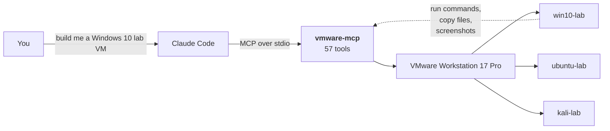
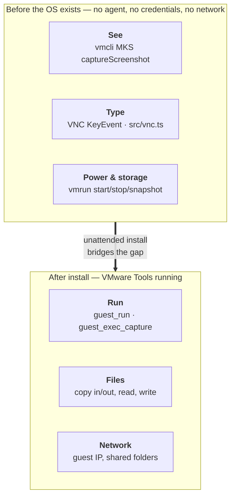
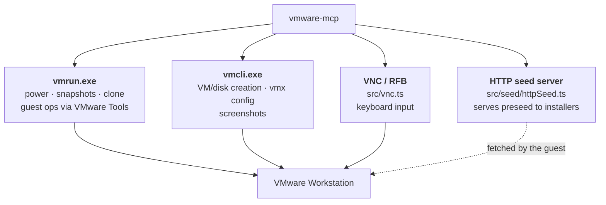
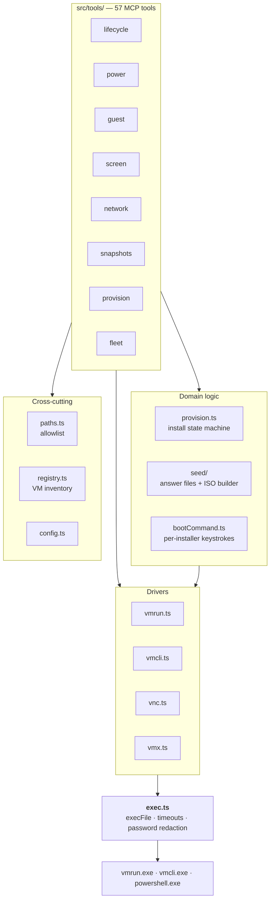
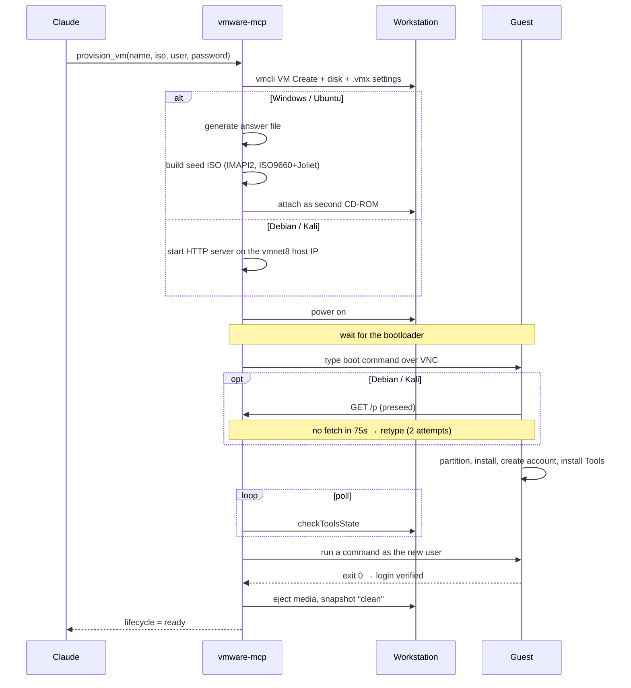
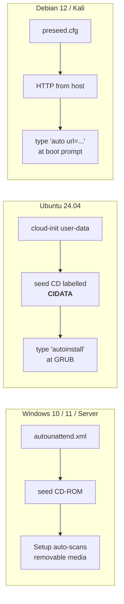
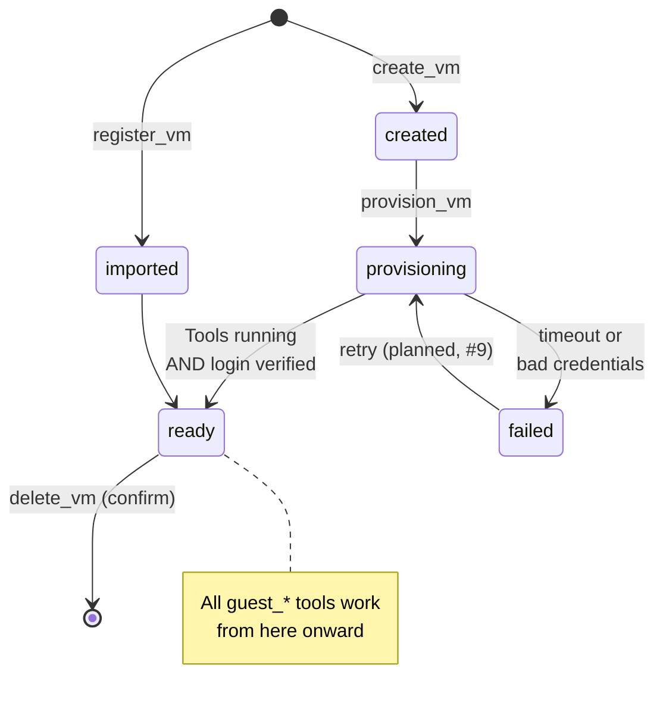
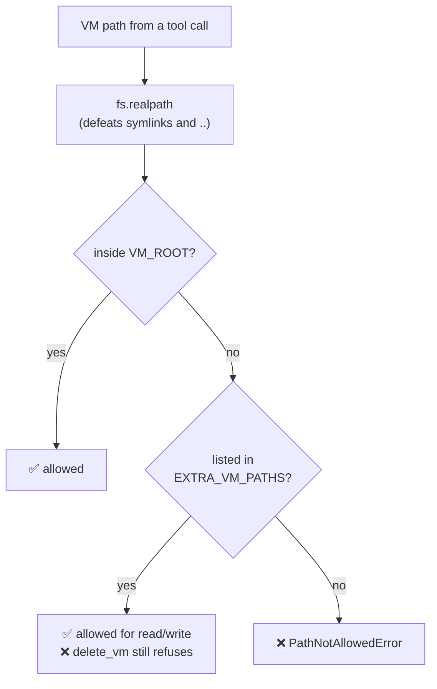
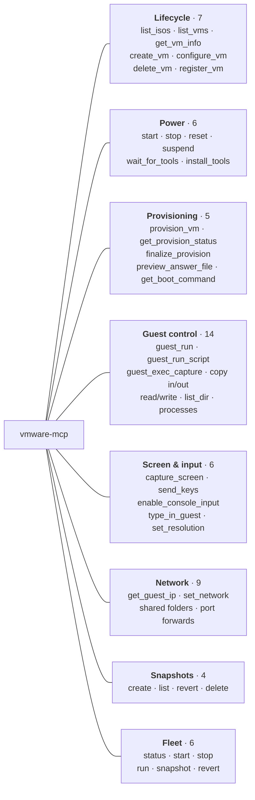

# Project scope & architecture

A guided tour for anyone arriving at this repo cold: what the project does, why
it exists, how it is put together, and which VMware interfaces it drives.

---

## 1. What this project is

**An MCP server that gives an AI agent hands inside VMware Workstation.**

Claude can already write a script. What it cannot normally do is *operate a
computer that has no operating system on it yet* — press a key at a boot menu,
read what a BIOS prompt says, answer an installer's questions. This server
provides that.

You ask for a VM. Roughly 30 minutes later you have a running machine with a
working login, and every tool needed to run commands inside it.

### What makes it different

Most VM automation can only talk to a guest that **already** boots, has an agent
installed, and has working networking. That is a large assumption: it cannot
install an OS, and it cannot help when networking is what's broken.

This server works in the gap before any of that exists.

The left-hand box is the interesting half, and the reason the odd design choices
below exist.

---

## 2. The three channels it drives

VMware exposes no single API that covers everything, so the server speaks three
protocols and picks per operation.

| Channel | Used for | Requires a guest OS? |
|---|---|---|
| `vmrun` | power, snapshots, clone, all `guest_*` operations | Guest ops: **yes** (VMware Tools + credentials) |
| `vmcli` | `VM Create`, disks, `.vmx` config, **screenshots** | No |
| VNC (RFB) | keyboard input at bootloaders and login screens | No |
| HTTP seed | handing `preseed.cfg` to Debian/Kali installers | No |

### Why VNC, and not the obvious API

`vmcli MKS sendKeyEvent` is the documented way to send a keystroke. On
Workstation 17.6.2 it **accepts its arguments, exits 0, and delivers nothing** —
verified against a live installer boot menu that never moved
([#1](../../issues/1)). Since every Linux installer needs a kernel argument that
an unmodified ISO cannot carry, a working keyboard is not optional: without it
**no Linux guest can be provisioned at all**.

So keyboard input goes over the VM's built-in VNC server using a small RFB
client (RFC 6143, ~250 lines). `create_vm` enables that console on every VM it
creates.

---

## 3. How the code is arranged

**The one rule:** tools never spawn processes. Everything funnels through
`exec.ts`, the single place `execFile` is called — so timeouts, error
normalisation, and password redaction are implemented once and cannot be
bypassed. Processes are spawned with an argv array and **never a shell**, so a
guest command coming from a model cannot be reinterpreted as host shell syntax.

| File | Responsibility |
|---|---|
| `exec.ts` | The only process spawner. Redacts anything after `-gp`/`-p`/`-vp` |
| `paths.ts` | Allowlist gate — every VM path resolves through `fs.realpath` |
| `registry.ts` | JSON inventory: name → vmx, OS family, lifecycle, tags, notes |
| `vmx.ts` | Parse and patch `.vmx` files (flat `key = "value"`) |
| `vnc.ts` | Minimal RFB client — the keyboard |
| `provision.ts` | The install state machine |
| `seed/isoBuilder.ts` | Builds answer-file ISOs via IMAPI2 (no Windows ADK needed) |
| `seed/sha512crypt.ts` | `$6$` password hashing, checked against spec vectors |

---

## 4. How an unattended install actually works

This is the core of the project. `provision_vm` takes a blank disk and an ISO and
returns a machine you can run commands on.

**"Ready" is proven, not assumed.** VMware Tools can report *running* before the
account is usable, so the server additionally executes a real command as the new
user. Only then does the VM become `ready`.

### Answer-file delivery differs per OS

Windows is the only one needing no kernel argument — Setup finds
`autounattend.xml` by itself, which makes it the most reliable path. The Linux
installers all need something typed, which is why the keyboard channel matters
so much.

Debian/Kali use HTTP rather than a second CD because `preseed/file=` is
unreliable when the installer disc already owns `/cdrom`. The server binds that
HTTP listener to the **vmnet8 host address only**, never `0.0.0.0`, so the answer
file is never exposed to the physical LAN.

---

## 5. VM lifecycle

---

## 6. The safety model

The server can destroy VMs, so every path is gated.

- **`G:\iso` is read-only.** ISOs can be listed and attached, never written.
  `VM_ROOT` is deliberately a *different* directory, so a `delete_vm` bug can
  never reach your install media.
- **Destructive tools require `confirm: true`** — `delete_vm`,
  `snapshot_revert`, `snapshot_delete`, `fleet_revert`.
- **Guest passwords** live in `%APPDATA%\vmware-mcp\credentials.json` and are
  referenced by name, so they need not appear in tool arguments. They are
  redacted from every error message and log line.

---

## 7. The 57 tools

Full descriptions in [README.md](../README.md); verification status per tool in
[ROADMAP.md](../ROADMAP.md).

---

## 8. Where to start reading

| Interest | Start here |
|---|---|
| Using it | [`README.md`](../README.md) |
| Why it's built this way | [`docs/field-notes.md`](field-notes.md) — seven real failures |
| What's done vs unproven | [`ROADMAP.md`](../ROADMAP.md) |
| The unusual code | `src/vnc.ts` (keyboard), `src/seed/isoBuilder.ts` (ISOs without the ADK), `src/seed/sha512crypt.ts` |
| The core logic | `src/provision.ts` |

### Honest status

About **22 of 57 tools are verified** against real hardware. The rest are built
but unproven, because everything downstream of a booting guest has been gated
behind completing an install. `ROADMAP.md` tracks this per tool rather than
claiming the whole surface works.
